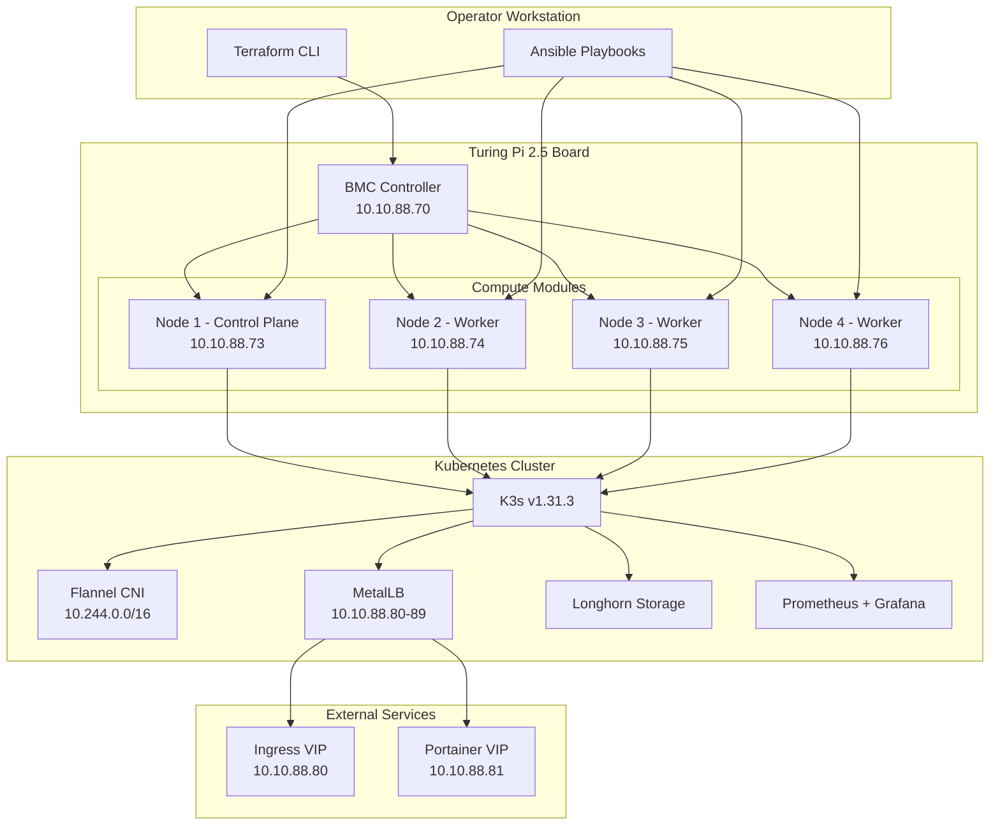
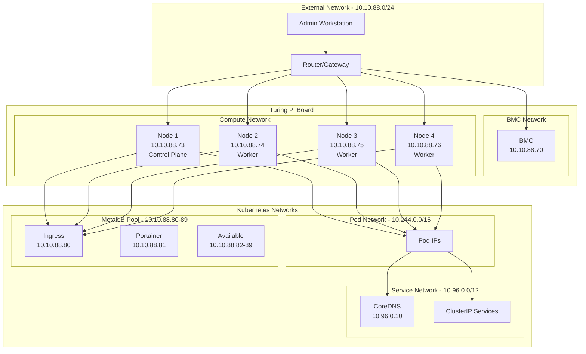
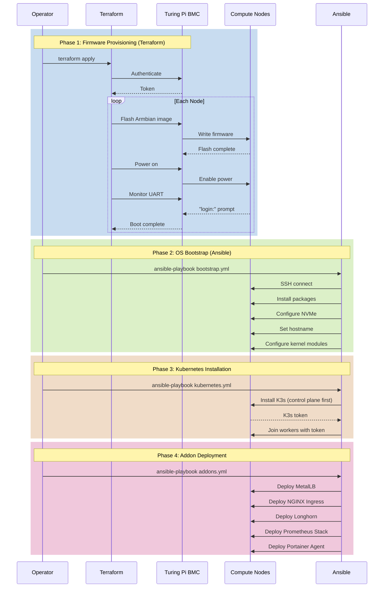
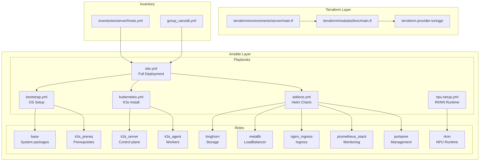
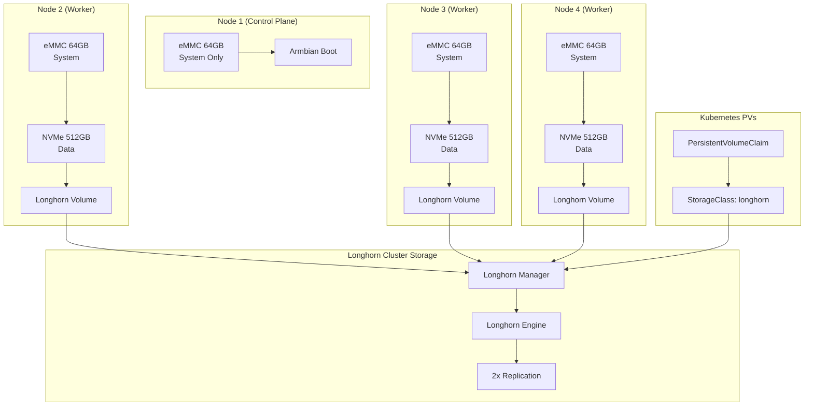
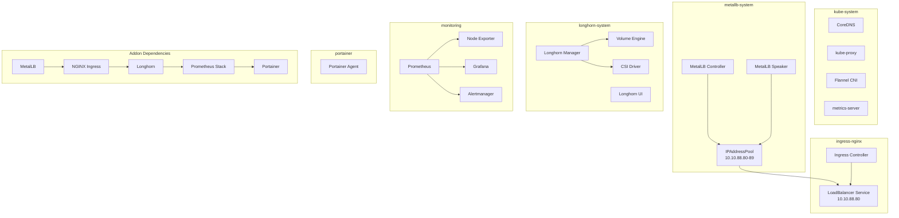
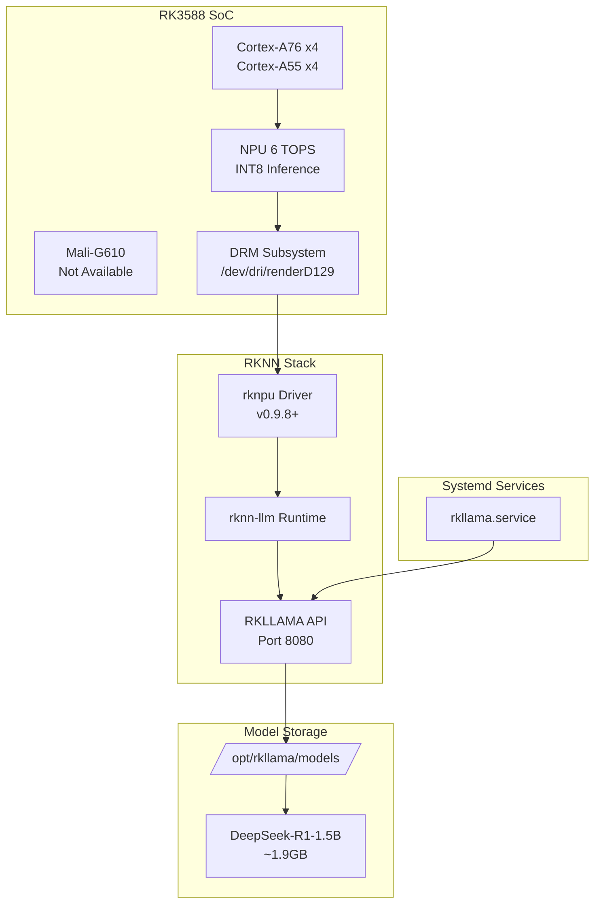
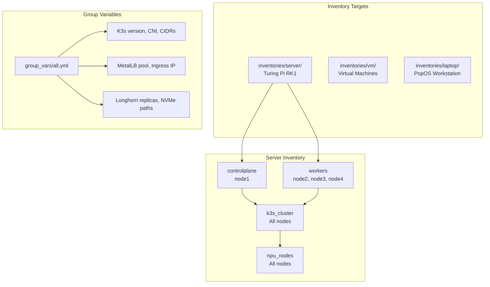

# Architecture Documentation

This document provides visual architecture documentation for the Turing Ansible Cluster - K3s deployment on Turing Pi RK1 hardware.

## Table of Contents

1. [System Overview](#system-overview)
2. [Network Topology](#network-topology)
3. [Deployment Pipeline](#deployment-pipeline)
4. [Component Interaction](#component-interaction)
5. [Storage Architecture](#storage-architecture)
6. [Kubernetes Stack](#kubernetes-stack)
7. [NPU Integration](#npu-integration)

---

## System Overview



---

## Network Topology



### IP Address Allocation

| Component | IP Address | Purpose |
|-----------|------------|---------|
| BMC | 10.10.88.70 | Board management |
| Node 1 | 10.10.88.73 | Control plane |
| Node 2 | 10.10.88.74 | Worker |
| Node 3 | 10.10.88.75 | Worker |
| Node 4 | 10.10.88.76 | Worker |
| Ingress VIP | 10.10.88.80 | NGINX Ingress |
| Portainer VIP | 10.10.88.81 | Management UI |
| Available | 10.10.88.82-89 | Future services |

---

## Deployment Pipeline



---

## Component Interaction



---

## Storage Architecture



### Storage Configuration

| Node | eMMC | NVMe | Longhorn Mount |
|------|------|------|----------------|
| Node 1 | 64GB (System) | - | - |
| Node 2 | 64GB (System) | 512GB | /var/lib/longhorn |
| Node 3 | 64GB (System) | 512GB | /var/lib/longhorn |
| Node 4 | 64GB (System) | 512GB | /var/lib/longhorn |

---

## Kubernetes Stack



---

## NPU Integration



### NPU Configuration

| Component | Details |
|-----------|---------|
| Driver | rknpu v0.9.8+ (vendor kernel) |
| Device | /dev/dri/renderD129 |
| Runtime | rknn-llm v1.2.3 |
| API Port | 8080 |
| CPU Cores | 4-7 (big cores for NPU) |

---

## Inventory Structure



---

## File Structure

```
turing-ansible-cluster/
├── terraform/
│   ├── modules/bmc/
│   │   └── main.tf           # turingpi_node resource
│   └── environments/server/
│       └── main.tf           # Node configurations
├── ansible/
│   ├── playbooks/
│   │   ├── site.yml          # Full deployment
│   │   ├── bootstrap.yml     # OS configuration
│   │   ├── kubernetes.yml    # K3s installation
│   │   ├── addons.yml        # Helm charts
│   │   └── npu-setup.yml     # RKNN runtime
│   ├── roles/
│   │   ├── base/             # System packages
│   │   ├── k3s_prereq/       # K3s prerequisites
│   │   ├── k3s_server/       # Control plane
│   │   ├── k3s_agent/        # Worker nodes
│   │   ├── longhorn/         # Distributed storage
│   │   ├── metallb/          # Load balancer
│   │   ├── nginx_ingress/    # Ingress controller
│   │   ├── prometheus_stack/ # Monitoring
│   │   ├── portainer/        # Management UI
│   │   └── rknn/             # NPU runtime
│   ├── inventories/
│   │   ├── server/           # Production cluster
│   │   ├── vm/               # Test VMs
│   │   └── laptop/           # Workstation
│   └── files/helm-values/    # Helm chart values
└── docs/
    ├── ARCHITECTURE.md       # This file
    ├── IMPLEMENTATION.md     # Deployment procedures
    ├── NETWORKING.md         # Network configuration
    ├── STORAGE.md            # Storage setup
    └── MONITORING.md         # Observability
```
